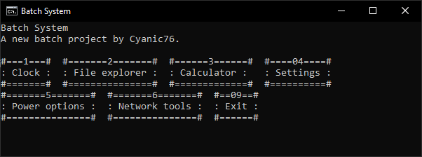

# Batch System
A system being developed on Batch (Command Prompt)

## Features

Read [this article](https://github.com/Cyanic76/batch-system/wiki/Features) on the Wiki.

*Note: More will be implemented in the future.*

## About

Batch System is a little batch program being in its early development period.

The first program to be implemented on that was [Power Options](https://github.com/Cyanic76/power-options-cli)

## Installation

Read [this article](https://github.com/Cyanic76/batch-system/wiki/Install-Batch-System) on the Wiki.

## Documentation

The documentation is available [here](https://github.com/Cyanic76/batch-system/wiki).

## Batch System

Another batch program project by Cyanic76.

License: GNU GPL V3
